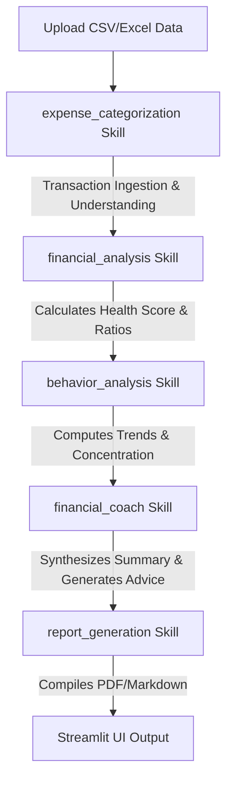

# Agent & Skill Architecture: CashFlow AI (MVP Baseline)

CashFlow AI uses a **modular, skill-based state-passing pipeline** designed according to Google's AI Agent guidelines. To keep complexity low, the MVP consolidates operations into four core, independent skills that operate sequentially on a central, in-memory state dictionary (`StateDict`).

---

## 1. System State Model

The entire application relies on a unified, serializable State dictionary (`StateDict`) containing all relevant user details. This state serves as the single source of truth across all skills:

```python
{
    "raw_data": {
        "transactions_df": pd.DataFrame, # Raw uploaded dataframe
        "assets": List[Dict],           # User assets (type, value, description)
        "liabilities": List[Dict],      # User liabilities (type, balance, interest, payment)
        "monthly_income": float,        # User declared or parsed monthly income
    },
    "processed_data": {
        "transactions_df": pd.DataFrame, # Parsed, typed, cleaned, and categorized transactions
        "ratios": {
            "savings_rate": float,
            "debt_ratio": float,
            "emergency_runway_months": float,
            "asset_coverage": float,
        },
        "financial_health_score": float, # Deterministic 0-100 score
        "behavior": {
            "spending_trends": Dict[str, Any],     # Week-over-week slopes
            "category_concentration": List[Dict],   # Sorted category percentages
            "potential_risk_indicators": List[str], # Detected deterministic warnings
        }
    },
    "user_memory": {
        "overrides": Dict[str, Dict], # Store user-defined merchant-to-category mappings
    },
    "agent_outputs": {
        "quick_wins": List[Dict], # AI-generated top 3 quick wins
        "roadmap": str,           # AI-generated markdown financial plan
    }
}
```

---

## 2. Skill Pipeline Flow

The execution workflow is structured as a sequential pipeline, prioritizing cost-efficiency and correctness:



---

## 3. Core Skill Definitions

### 3.1. Expense Categorization / Transaction Understanding Skill (`skills/expense_categorization`)
- **Responsibility**: Ingest raw transactions, standardize headers, extract clean merchant names, identify transaction types, and assign budget categories.
- **Logic**:
  1. *Ingestion*: Maps arbitrary CSV/Excel headers to canonical schema (`date`, `description`, `amount`).
  2. *Type Identification*: Classifies each transaction into `Income`, `Expense`, `Transfer`, `Investment`, `Loan/Debt`, or `Refund`.
  3. *Merchant Extraction*: Cleans noisy transaction strings using regex filters to isolate core merchant names (e.g. `STARBUCKS #124 NY` $\rightarrow$ `Starbucks`).
  4. *Hierarchical Resolution*:
     - **Step 1: Rules**: Checks description against local exact match lists.
     - **Step 2: Patterns**: Evaluates regular expressions (e.g. `.*PAYROLL.*` $\rightarrow$ Income).
     - **Step 3: Stored Memory**: Matches against previously stored user override maps.
     - **Step 4: AI Fallback**: Sends unrecognized descriptions in small batches to Gemini 2.5 Flash.
- **Interface**:
  ```python
  def run_transaction_understanding(state: Dict) -> Dict
  ```

### 3.2. Financial Analysis Skill (`skills/financial_analysis`)
- **Responsibility**: Calculate baseline ratio metrics and compute the Financial Health Score.
- **Logic**: Purely deterministic (Pandas).
  - Isolates transactions of type `Income` and `Expense` (excluding `Transfers` to avoid double-counting).
  - Computes the four key ratios: Savings Rate, Debt Ratio, Emergency Runway, and Asset Coverage.
  - Computes the deterministic **Financial Health Score (0-100)** as specified in the scoring methodology.
- **Interface**:
  ```python
  def run_financial_analysis(state: Dict) -> Dict
  ```

### 3.3. Behavior Analysis Skill (`skills/behavior_analysis`)
- **Responsibility**: Calculate spending trends, discretionary category concentrations, and flag deterministic risk indicators.
- **Logic**: Purely deterministic (Pandas).
  - *Spending Trends*: Calculates week-over-week changes in discretionary (`Wants`) spending.
  - *Category Concentration*: Identifies the proportion of spending in each discretionary category.
  - *Risk Indicators*: Flags binary events (e.g. Cash flow deficit: Outflow > Income; Subscription Sprawl: high count of recurring items).
- **Interface**:
  ```python
  def run_behavior_analysis(state: Dict) -> Dict
  ```

### 3.4. Financial Coach Skill (`skills/financial_coach`)
- **Responsibility**: Generate strategic recommendations, risks, and a goal roadmap using a single Gemini reasoning agent.
- **Logic**:
  - Gathers the calculated metrics, ratios, score, concentrations, and risk flags from the state.
  - Formulates a system prompt supplying these metrics as a compact JSON block.
  - Queries Gemini 2.5 Flash to output exactly 3 "Quick Wins" (as JSON) and a long-term goal roadmap (as markdown).
- **Interface**:
  ```python
  def run_financial_coach(state: Dict) -> Dict
  ```

### 3.5. Report Generation Skill (`skills/report_generation`)
- **Responsibility**: Compile the output into a downloadable file.
- **Logic**: Gathers the calculated values, charts, and the AI-generated coach response, formatting them into a standard, clean Markdown structure.
- **Interface**:
  ```python
  def run_report_generation(state: Dict) -> str
  ```

---

## 4. Privacy, Performance, and Sustainability Guidelines

* **Aggregated Contexts**: Never feed individual transaction line items to Gemini. Instead, feed category-level aggregates and calculated behavior parameters to the LLM (typically under 400 tokens of input context).
* **Deterministic Priority**: All calculations (ratios, health score, spending trends, concentrations, subscription checks) must be computed in Python, never by the LLM. Keep the LLM focused strictly on qualitative coaching and recommendation text synthesis.
* **Stateless Operation**: The pipeline is stateless and operates completely in memory, making it highly secure and compatible with Kaggle notebooks and Streamlit hosting.
