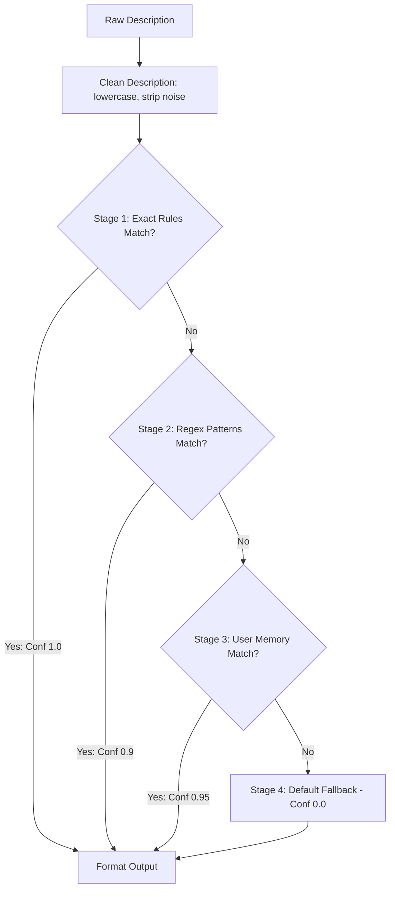

# Implementation Spec: Transaction Ingestion & Understanding

This document specifies the technical design, logic layers, and mapping rules for the deterministic Transaction Ingestion & Understanding Layer. The engine operates strictly in a rule-based manner before any AI components are integrated.

---

## 1. Interface & Data Structures

For each transaction, the engine processes the raw description and amount and returns a structured dictionary:

```python
{
    "transaction_type": str,   # Income, Expense, Transfer, Investment, Loan/Debt, Refund
    "category": str,           # Wants, Needs, Savings, Debt Payments, Income, Other
    "merchant_name": str,       # Cleaned merchant name
    "confidence_score": float   # Score between 0.0 and 1.0 reflecting confidence
}
```

### Supported Tiers & Mappings:
| Transaction Type | Default Category | Description |
| :--- | :--- | :--- |
| **Income** | `Income` | Salaries, side gig revenues, interest payments. |
| **Expense** | `Needs` or `Wants` | Discretionary (Wants) or essential (Needs) costs. |
| **Transfer** | `Savings` | Moving money between linked checking, savings, or credit cards. |
| **Investment** | `Savings` | Buying stocks, depositing into Vanguard/Fidelity. |
| **Loan/Debt** | `Debt Payments` | Mortgage, student loan, or auto loan principal payments. |
| **Refund** | `Wants` or `Needs` | Credit returns from merchants (negates past expenses). |

---

## 2. Multi-Stage Pipeline Logic

The engine executes in a sequential, deterministic pipeline. Once a match is found, processing stops for that transaction.



### Stage 1: Rule-Based Matcher (Exact Matching)
- **Logic**: Convert the description to uppercase, strip leading/trailing spaces, and look up in a predefined exact match dictionary.
- **Predefined Rules Dictionary**:
  - `"NETFLIX"` $\rightarrow$ Type: `Expense`, Category: `Wants`, Merchant: `"Netflix"`, Confidence: `1.0`
  - `"SPOTIFY"` $\rightarrow$ Type: `Expense`, Category: `Wants`, Merchant: `"Spotify"`, Confidence: `1.0`
  - `"STARBUCKS"` $\rightarrow$ Type: `Expense`, Category: `Wants`, Merchant: `"Starbucks"`, Confidence: `1.0`
  - `"CHRONIC TACOS"` $\rightarrow$ Type: `Expense`, Category: `Wants`, Merchant: `"Chronic Tacos"`, Confidence: `1.0`
  - `"LANDLORD RENT"` $\rightarrow$ Type: `Expense`, Category: `Needs`, Merchant: `"Rent"`, Confidence: `1.0`

### Stage 2: Pattern Matcher (Regex Matching)
- **Logic**: ApplyCompiled regular expressions to extract merchants and classify transaction details.
- **Regex Patterns Table**:
  
  | Pattern (Regex) | Extracted Merchant | Type | Category | Conf |
  | :--- | :--- | :--- | :--- | :--- |
  | `r"PAYROLL\|DIRECT DEP\|DIR DEP"` | `"Payroll"` | `Income` | `Income` | `0.9` |
  | `r"AMAZON.*RE(FUND\|T|TURN)"` | `"Amazon"` | `Refund` | `Wants` | `0.9` |
  | `r"AMAZON"` | `"Amazon"` | `Expense` | `Wants` | `0.9` |
  | `r"VANGUARD\|FIDELITY"` | `"Vanguard"` or `"Fidelity"` | `Investment`| `Savings` | `0.9` |
  | `r"STUDENT LOAN\|DEPT ED"` | `"Student Loan"` | `Loan/Debt` | `Debt Payments`| `0.9` |
  | `r"TRANSFER.*SAVINGS"` | `"Savings Transfer"` | `Transfer` | `Savings` | `0.9` |
  | `r"CONEDISON\|UTILITY"` | `"ConEd"` | `Expense` | `Needs` | `0.9` |

### Stage 3: User Memory Lookup (Overrides)
- **Logic**: Search user override dictionary (`state["user_memory"]["overrides"]`). 
- **Matching Rules**: If a description has been manually assigned by the user to a specific type/category/merchant before, apply that mapping.
- **Confidence**: Set to `0.95`.

### Stage 4: Default Fallback
- **Logic**: If no rules, patterns, or overrides match:
  - If Amount $>$ 0: Type: `Income`, Category: `Income`, Merchant: Cleaned raw description, Confidence: `0.0`.
  - If Amount $\le$ 0: Type: `Expense`, Category: `Other`, Merchant: Cleaned raw description, Confidence: `0.0`.
- **Note**: A confidence of `0.0` acts as a flag for the downstream UI to show a dropdown to the user or trigger the future AI classification fallback.

---

## 3. String Cleaning Utility

Before matching, descriptions must be sanitized to isolate the merchant name:
1. Strip transaction prefixes: `POS PUR`, `DEBIT CARD PURCHASE`, `CHECK CARD`, `ACH WITHDRAWAL`, `ONLINE PAYMENT`.
2. Strip suffixes: City names, states (e.g., `NY`, `CA`), zip codes, and unique numeric transaction hashes (e.g., `#1239582`).
3. Standardize spaces: Replace multiple spaces with a single space.
